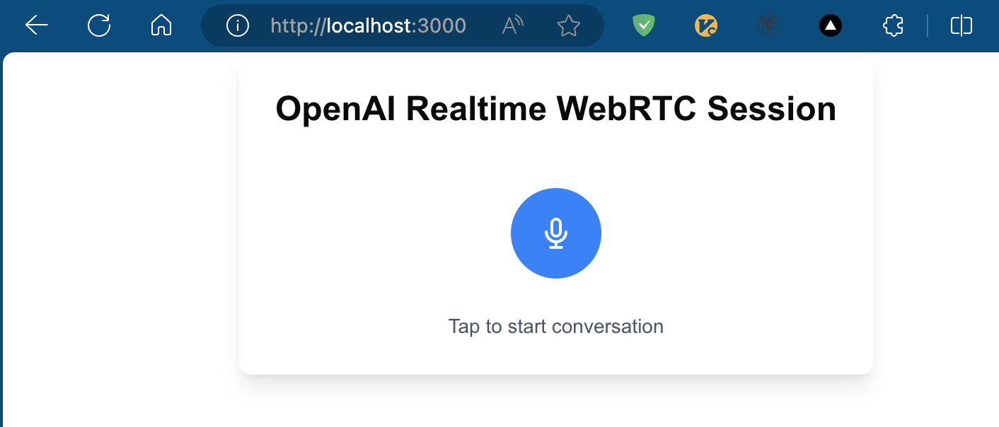

## Getting Started
1 Jan 2025

`next14, OpenAI Realtime API, WebRTC`



_Reference_: https://platform.openai.com/docs/guides/realtime-webrtc

## Run it

```
pnpm install 
pnpm run dev
```


## TODO - for Pi4b
```
# on macos

docker build -t jojo-client .
docker save jojo-client > jojo-client.tar
```


```
# on pi4

docker load < jojo-client.tar
docker run -d \
  -p 3000:3000 \
  -e OPENAI_API_KEY=your_api_key \
  --device /dev/snd \
  --name jojo-client \
  jojo-client
```

However, pi4 need USB microphone support. 
